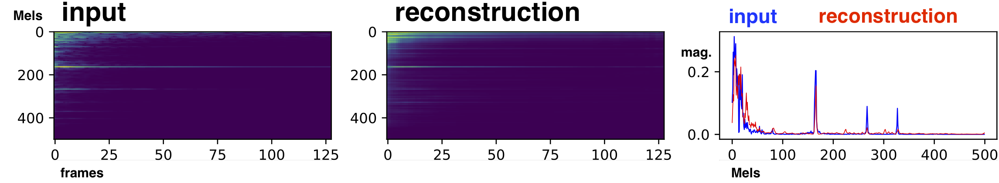
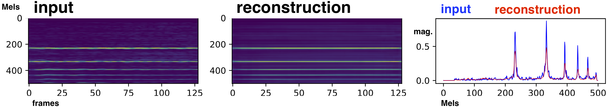
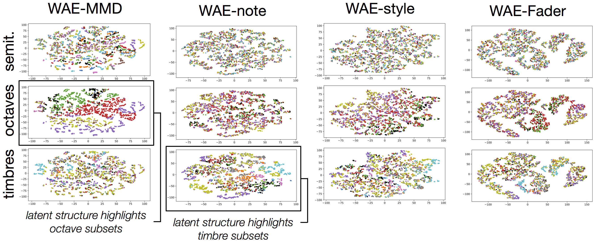
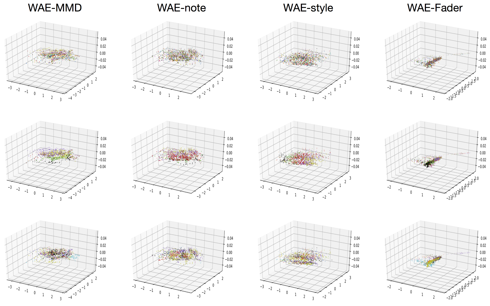
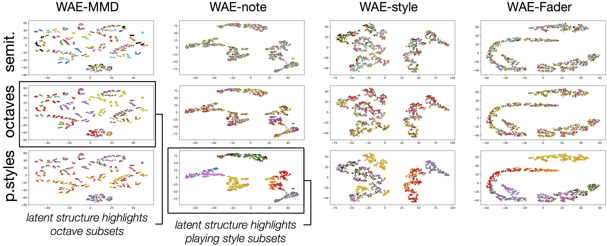
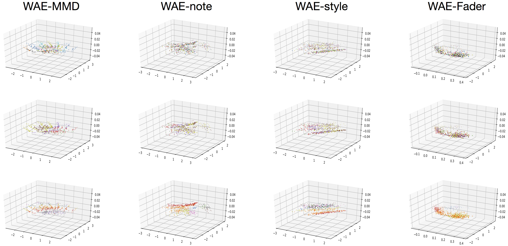
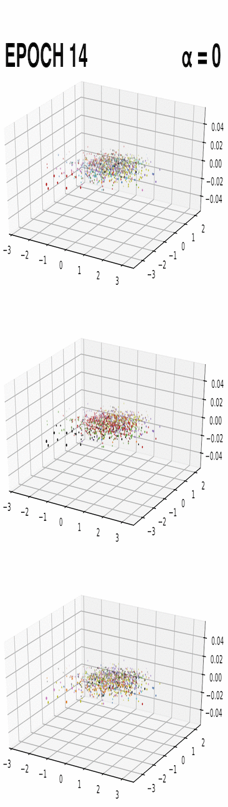
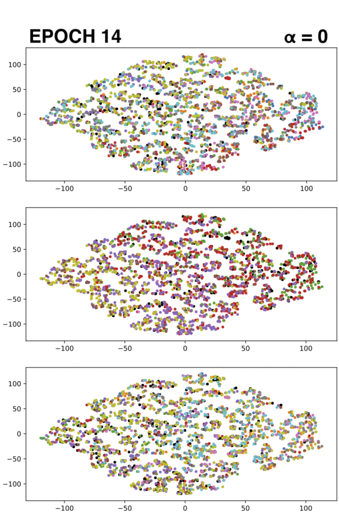

# Assisted Sound Sample Generation with Musical Conditioning in Adversarial Auto-Encoders

This repository is a companion to the DAFx19 submission:
Adrien Bitton, Philippe Esling, Antoine Caillon, Martin Fouilleul, "Assisted Sound Sample Generation with Musical Conditioning in Adversarial Auto-Encoders".

Preliminary works can be accessed at https://github.com/adrienchaton/Timbre_MoVE and https://github.com/nebularnoise/serge.

An Arxiv pre-print can be accessed at https://arxiv.org/abs/1904.06215. However, the paper is **not reviewed** yet.

☆ﾟ This demonstration repository is in progress, additional results from the final experiment will be uploaded, as well as codes and plugin implementation after the reviewing process.

## ABSTRACT

*Deep generative neural networks* have thrived in the field of computer vision, enabling unprecedented intelligent image processes. Yet the results in audio remain less advanced and many applications are still to be investigated. Our project targets real-time sound synthesis from a reduced set of high-level parameters, including semantic controls that can be adapted to different sound libraries and specific tags. These generative variables should allow expressive modulations of target musical qualities and continuously mix into new styles.

To this extent we train *auto-encoders* on an orchestral database of individual note samples, along with their intrinsic attributes: note class, *timbre domain* (an instrument subset) and *extended playing techniques*. We condition the decoder for explicit control over the rendered note attributes and use *latent adversarial training* for learning expressive style parameters that can ultimately be mixed. We evaluate both generative performances and correlations of the attributes with the latent representation. Our ablation study demonstrates the effectiveness of the *musical conditioning* mechanisms. 

The proposed model generates notes as magnitude spectrograms from any probabilistic latent code samples, with expressive control of orchestral timbres and playing styles. Its training data subsets can directly be visualized in the 3-dimensional latent representation. Waveform rendering can be done offline with the *Griffin-Lim algorithm* (GLA). In order to allow real-time interactions, we fine-tune the decoder with a pretrained magnitude spectrogram inversion network and embed the full waveform generation pipeline in a *plugin*. Moreover the encoder could be used to process new input samples, after manipulating their latent attribute representation, the decoder can generate sample variations as an *audio effect* would. Our solution remains rather light-weight and fast to train, it can directly be applied to other sound domains, including an *user's libraries* with *custom sound tags* that could be mapped to specific generative controls. As a result, it fosters creativity and intuitive audio style experimentations.

♪ **WAE-Fader implementation:** the model uses a non-conditional encoder with *Batch-Norm* (BN), the decoder is *conditional* with *Adaptive Instance Normalization* (AdaIN) and *Feature Wise Linear Modulation* (FiLM). The WAE latent regularization uses *MMD-Rbf* and isotropic *gaussian prior*. The encoder adversarially trains against a *Fader* latent discriminator to enforce the decoder conditioning. Waveform synthesis is made real-time capable by pairing the decoder with a *Multi-head Convolution Neural Network* (MCNN).

The following sections detail some materials that could not be included in the paper submission:
+ [Additional visualizations](#Additional-visualizations)
+ *Test spectrogram reconstructions*
+ *Latent spaces and adversarial training*
+ [Sound examples](#Sound-examples)
+ *Test set reconstructions inverted with GLA*
+ *Random conditional note generations with WAE-style or WAE-Fader*
+ *Expressive style and timbre synthesis with WAE-Fader*
+ *{WAE-Fader ☉ MCNN} waveform synthesis*

## Additional visualizations

♪ **Test spectrogram reconstructions**

We plot log-scaled input Mel-spectrogram magnitudes and corresponding WAE-Fader reconstructions. The two following are random test set notes from the *ordinario timbre model* (up) and the *violin playing style model* (down).

https://github.com/adrienchaton/Expressive_WAE_FADER/blob/master/figures/Fader_rec_allinst_ordinario.pdf

https://github.com/adrienchaton/Expressive_WAE_FADER/blob/master/figures/Fader_rec_violin_allstyle.pdf

♪ **Latent spaces and adversarial training**

We plot the learned latent representations of different models and data subsets. 3-dimensional scatter plots are the raw latent coordinates, 2-dimensional projections are done with t-SNE (t-distributed Stochastic Neighbor Embedding). We use colors to highlight the different attribute subsets: **semitones** (#12 subset coloring in the first rows), **octaves** (#9 in the second rows) and **styles** (third rows for playing techniques or timbre domains).

+ *WAE-MMD* is not conditioned, only MMD-Rbf regularization is applied
+ *WAE-note/style* are note/style conditional
+ *WAE-Fader* trains an additional adversarial objective against a Fader latent discriminator that classifies style attributes

☽ The following plots display the final latent representations learned by the models of the ablation study training on the 12 instrument subsets of SOL with all playing styles mixed. Accordingly the bottom row has coloring for these 12 timbre domains, which are the style attributes being classified in the WAE-Fader.

https://github.com/adrienchaton/Expressive_WAE_FADER/blob/master/figures/TSNE2Ds_allinst_allstyle.pdf

WAE-MMD (only regularization, no conditioning) mainly highlights octave classes (2nd row) while WAE-note more strongly relates to the style subsets (timbre domains), as the note conditioning already accounts for these features. WAE-style and WAE-Fader both tend to equally mix each type (row) of attribute.

https://github.com/adrienchaton/Expressive_WAE_FADER/blob/master/figures/RAW3Ds_allinst_allstyle.pdf

☽ The following plots display the final latent representations learned by the models of the ablation study training on the 10 playing style subsets of the violin. Accordingly the bottom row has coloring for these 10 playing style domains, which are the style attributes being classified in the WAE-Fader.

https://github.com/adrienchaton/Expressive_WAE_FADER/blob/master/figures/TSNE2Ds_violin_allstyle.pdf

https://github.com/adrienchaton/Expressive_WAE_FADER/blob/master/figures/RAW3Ds_violin_allstyle.pdf

For WAE-Fader models, we as well monitor the evolution of the latent representation throughout the model training and adversarial latent classification. In this setting, the Fader latent discriminator tries to classify style attributes from the non-conditional encoder output **z**. In turn and after the **α-warmup** has started, the encoder tries to fool the discriminator so that its latent representation cannot be properly classified. It encourages an attribute-free latent code and pushes the decoder to learn its conditioning. At first is pre-classification, only the Fader classification is optimized without adversarial back-propagation in the encoder (α=0). After this and until the end of the first half of training epochs, α is gradually increased to its target value (warmup:0➔4) and then remains fixed until the end of the training.

☽ The following animations display the evolution of the latent representation for a WAE-Fader model training on the 12 instrument subsets of SOL with all playing styles mixed. Accordingly, the bottom row has coloring for these 12 timbre domains, the style attributes of the WAE-Fader, being classified.

<!---  
  -->

animated raw 3D latents    |  animated TSNE 2D latents
:-------------------------:|:--------------------------------------------------:
  |  

## Sound examples

We host on soundcloud the audio files for streaming faster.

♪ **Test set reconstructions inverted with GLA**

We give test set Mel-spectrogram magnitude reconstructions inverted to waveform with GLA (iterative) to allow for individual listening and evaluation of this initial audio quality. Since we train on Mel-frequencies, we approximate the generated magnitudes to the linear scale and perform GLA for 100 to 300 iterations. This induces an inherent loss of audio-quality and latency that prevents from live interactions.

https://soundcloud.com/user-992344055/sets/test_set_note_rec

Each input sample is followed with a model reconstruction inverted with GLA. We show results of WAE-style and WAE-Fader both conditioned on the playing styles of the violin. Plus the reconstructions of WAE-Fader trained on playing styles of other instruments: french-horn, clarinet, piano and trumpet.

♪ **Random conditional note generations with WAE-style or WAE-Fader**

We give some random note samples, that were generated in the same way as for the note-conditional generative evaluation. Given a random latent point sampled from the model prior and random note targets with octave either in {3-4} (common to all instrument tessitura) or in {0-8} (full orchestral range), we decode on each model's style attribute and invert to waveform with GLA. Here we control the categorical style classes that correspond to each training data subset.

We can see that accordingly to the evaluations of WAE-style, it does not render meaningful audio variations with respect to the target style attributes (both for playing techniques and timbres). Whereas, WAE-Fader produces consistent sound variations that express the desired target qualities. It demonstrates its ability to efficiently learn and generalize the conditional controls to random samples from the prior, as validated by our final evaluations.

We have the following models with playing style conditioning:

+ WAE-style on violin playing styles, series of: sustained ; short ; non-vibrato ; ordinario ; staccato ; pizzicato-secco ; medium-vibrato-short ; tremolo ; medium-vibrato-sustained ; pizzicato-l-vib (o34)

+ WAE-fader on violin playing styles, series of: sustained ; short ; non-vibrato ; ordinario ; staccato ; pizzicato-secco ; medium-vibrato-short ; tremolo ; medium-vibrato-sustained ; pizzicato-l-vib (o34)

We have the following models with timbre (instrument) conditioning:

+ WAE-style on ordinario timbres, series of: piano ; oboe ; english-horn ; flute ; bassoon ; violin ; alto-saxophone ; tenor-trombone ; clarinet ; french-horn ; violoncello ; trumpet (o34)

+ WAE-fader on ordinario timbres, series of: piano ; tenor-trombone ; english-horn ; alto-saxophone ;  oboe ; flute ; clarinet ; bassoon ; french-horn ; violoncello ; trumpet ; violin (o34)

+ WAE-fader on ordinario timbres, series of: piano ; tenor-trombone ; english-horn ; alto-saxophone ;  oboe ; flute ; clarinet ; bassoon ; french-horn ; violoncello ; trumpet ; violin (o9)

https://soundcloud.com/user-992344055/sets/cond_note_gen

♪ **Expressive style and timbre synthesis with WAE-Fader**

We as well give conditional notes generated with WAE-Fader models on playing styles of other instruments.

We have the following models with playing style conditioning: french-horn ; tenor-trombone ; clarinet ; piano

https://soundcloud.com/user-992344055/sets/cond_note_gen_waefader

Since we demonstrated the ability of WAE-Fader to generate and control random note samples consistently with each of its attribute subsets, we further explore the potential expressivity enabled when continuously mixing the learned *fader* style variables. We could for instance imagine some "Pizzimolo" as *0.5 Pizzicato-secco + 0.5 Tremolo* or "Clariolin" as *0.5 Clarinet + 0.5 Violin* or .. ?? ☆ﾟ.*･｡ﾟ

The following audio files are conditional notes generated with expressive attribute control in WAE-Fader. We again decode series of note variations from any random latent coordinate (along with random note target) by mixing two continuous attribute conditions. We select two model attributes, either ordinario timbres or playing styles from the violin, and continuously mix their one-hot codes (including to conditions above 1) rather than inputing single categorical style conditions.

This intends to produce sound hybrids and diverse style variations around the learned attributes. It gives a glimpse of the sounds that could be intuitively explored with WAE-Fader in a real-time interactive setting. For the violin playing styles, we show some mixes of *pizzicato-secco + tremolo* ; *tremolo + pizzicato-l-vib* and *short + medium-vibrato-sustained*. For the ordinario timbres, we show some mixes of *clarinet + violin* ; *oboe + english-horn* ; *alto-saxophone + french-horn* ; *trumpet + piano* ; *bassoon + violoncello* and *flute + violoncello*.

https://soundcloud.com/user-992344055/sets/express_note_gen

♪ **{WAE-Fader ☉ MCNN} waveform synthesis**

We give feed-forward inversions to waveform with MCNN (real-time capable) to allow for individual listening and evaluation of the audio quality we achieve in this setting. The MCNN directly inverts from the Mel-frequencies, however, the results are perfectible and we currently work on improved waveform modeling for real-time high-quality sound synthesis. This will ultimately be used for the plugin development, so that it runs real-time with GPU.

The following audio files are both feed-forward waveform reconstructions and conditional note generations.

We fine-tune the WAE-Fader ordinario timbre model with a pretrained MCNN and achieve the following audio quality for train and test set note reconstructions as well as for (categorical) conditional note generations. We as well show results for the fine-tuning with the violin playing style model.

https://soundcloud.com/user-992344055/sets/waefader_mcnn_audio

## ✿ Upcoming

+ Final plugin development and demonstration
+ Code release and experiments on other sound libraries
+ Improved audio-quality and end-to-end waveform modeling
